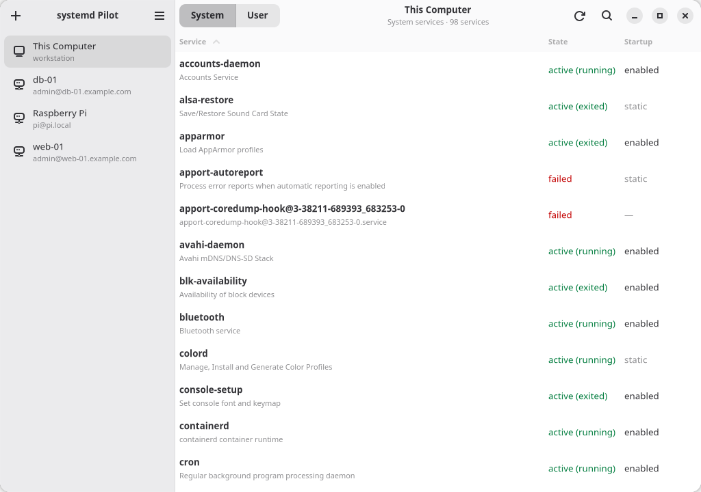
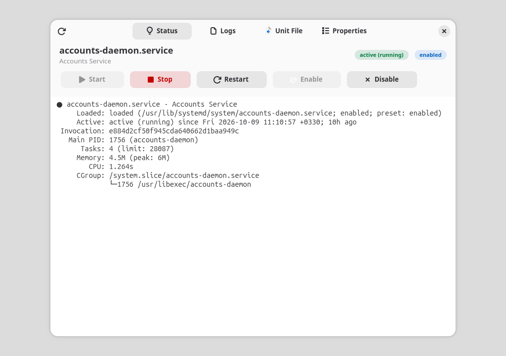

# systemd Pilot

<p align="center">
  
</p>

systemd Pilot is a desktop app for managing systemd services on your local machine or remotely over SSH. 





## Features

- Browse system and user services, with instant search (just start typing)
- Start, stop, restart, enable and disable services
- Read a service's status, logs, unit file and properties
- Create and edit unit files, optionally enabling and starting new services
- Manage remote hosts over SSH with a password, a private key or your SSH agent

## Install

Download the package for your distribution from the
[releases](https://github.com/mfat/systemd-pilot/releases) page:

| Package | Works on |
| --- | --- |
| `systemd-pilot_*_all.deb` | Debian 13+, Ubuntu 24.04+ |
| `systemd-pilot-*.noarch.rpm` | Fedora |
| `systemd-pilot-*.flatpak` | Any distribution with Flatpak |
| `systemd-pilot-*-x86_64.AppImage` | Ubuntu 22.04+ and most other x86_64 distributions (no install) |

```sh
flatpak install --user systemd-pilot-x86_64.flatpak
```

```sh
chmod +x systemd-pilot-*-x86_64.AppImage
./systemd-pilot-*-x86_64.AppImage
```

On a system without FUSE, run the AppImage with `--appimage-extract-and-run`.

The AppImage carries its own GTK 4, libadwaita and Python, so it runs on
releases too old for the `.deb`, such as Ubuntu 22.04. On those, and on systems
without `libGLESv2`, it draws with GTK's software (cairo) renderer instead of
OpenGL; set `GSK_RENDERER` to override.

## How it works

- **This computer:** systemd Pilot runs `systemctl` and `journalctl`. Changes to
  system services go through `pkexec`, so your desktop's polkit dialog asks for
  the password; the app never sees it. Inside Flatpak, commands run on the host
  through `flatpak-spawn --host`.
- **Remote hosts:** commands run over SSH, and changes use `sudo`. The sudo
  password is sent on the command's standard input, never on its command line,
  and it is kept in memory only for the current connection. Host keys are
  checked against `~/.ssh/known_hosts`, and you are asked to confirm the
  fingerprint of a host you haven't connected to before. A host set up with a
  private key authenticates with that key only, not with other agent keys.
- Saved SSH passwords and key passphrases live in your keyring (libsecret).
  Without a keyring, the app still works but can't remember passwords.
  Hosts are stored in `~/.config/systemd-pilot/hosts.json`. Hosts saved by
  version 3 are imported automatically.

## Build from source

Dependencies (meson and gettext are only needed to build and install):

- meson ≥ 1.0, gettext, `glib-compile-resources`, `glib-compile-schemas`
- Python ≥ 3.10, PyGObject, paramiko
- GTK ≥ 4.12, libadwaita ≥ 1.5, libsecret, GtkSourceView 5 (all with GObject introspection data)

On Debian and Ubuntu:

```sh
sudo apt install meson gettext libglib2.0-dev-bin desktop-file-utils appstream \
  python3-gi gir1.2-gtk-4.0 gir1.2-adw-1 gir1.2-secret-1 gir1.2-gtksource-5 python3-paramiko
```

On Fedora:

```sh
sudo dnf install meson gettext glib2-devel desktop-file-utils appstream \
  python3-gobject gtk4 libadwaita libsecret gtksourceview5 python3-paramiko
```

Run it straight from the checkout, no build needed:

```sh
python3 run.py        # add -v for debug output
```

Or build and test with meson:

```sh
meson setup build
meson compile -C build
meson test -C build
meson devenv -C build python3 -m systemdpilot
```

Install:

```sh
meson setup build --prefix=/usr
meson install -C build
```

Build the Flatpak:

```sh
flatpak-builder --user --install --force-clean flatpak-build build-aux/flatpak/io.github.mfat.systemdpilot.json
```

Build the AppImage (Ubuntu 24.04 host; needs `patchelf`, `wget`, and the runtime
dependencies above, plus `adwaita-icon-theme`, `librsvg2-common`,
`dconf-gsettings-backend`, `python3-gi-cairo` and `python3-pip`):

```sh
xvfb-run -a packaging/appimage/build-appimage.sh   # writes dist/*.AppImage
```

Test a built AppImage on the system you run this on (CI does it on Ubuntu 22.04):

```sh
dbus-run-session -- xvfb-run -a packaging/appimage/test-appimage.sh dist/*.AppImage
```

## Project layout

```
src/systemdpilot/
  core/        business logic, no GTK imports
    manager.py      systemd operations (list, control, logs, create units)
    runner.py       command runner interface
    local.py        runs commands on this computer (pkexec, flatpak-spawn)
    ssh.py          runs commands over SSH (sudo, host key checks)
    parsers.py      systemctl/journalctl output parsers
    hosts.py        saved hosts; secrets.py, known_hosts.py
  ui/          GTK 4 / libadwaita interface (.py + .ui templates)
  main.py      Adw.Application
data/          desktop file, metainfo, GSettings schema, icons
po/            translations
tests/         pytest suite for the core, plus a UI smoke test
build-aux/     Flatpak manifest, version check
debian/, packaging/rpm/   distribution packaging
```

The UI calls into `core` from worker threads and never builds shell commands
itself.

`tests/` has pytest tests for `core` (command construction, parsers, the local
and SSH runners, host storage, host keys). They don't need a display. The UI is
covered only by `tests/smoke_ui.py`, which opens each window and dialog and
exercises a few flows. It runs in CI under Xvfb.

## Releasing

1. Bump the version in `meson.build`, `debian/changelog`,
   `packaging/rpm/systemd-pilot.spec`, `data/systemd-pilot.1` and the
   `<releases>` in `data/io.github.mfat.systemdpilot.metainfo.xml.in`.
   `build-aux/check-version.py` verifies that they agree.
2. Tag and push: `git tag v4.0.0 && git push origin v4.0.0`.

The release workflow builds the `.deb`, `.rpm` and Flatpak bundles (x86_64 and
aarch64) and attaches them to a GitHub release.

To update the Python modules bundled in the Flatpak, run
`build-aux/flatpak/update-python-deps.py`.

## Translations

Add your language code to `po/LINGUAS`, then:

```sh
meson compile -C build systemd-pilot-pot
meson compile -C build systemd-pilot-update-po
```

## Support development

Bitcoin: `bc1qqtsyf0ft85zshsnw25jgsxnqy45rfa867zqk4t`

Doge: `DRzNb8DycFD65H6oHNLuzyTzY1S5avPHHx`
